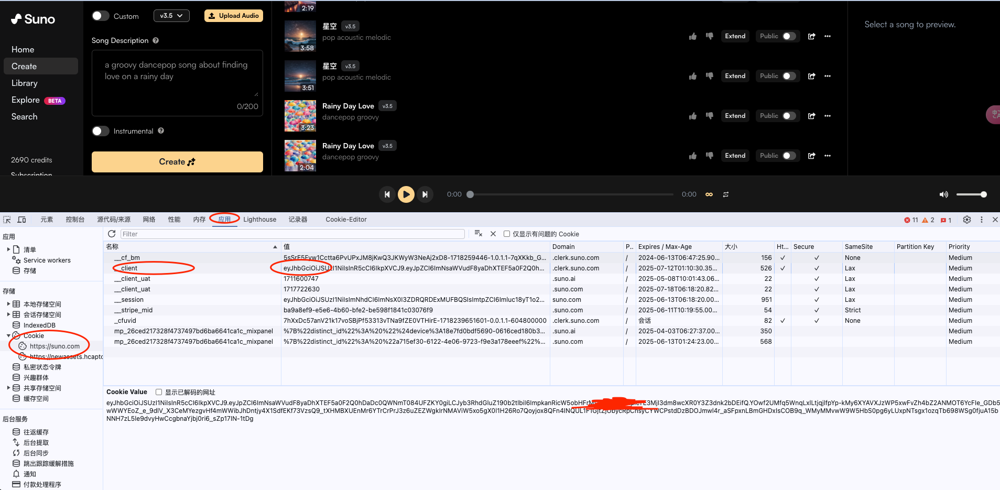
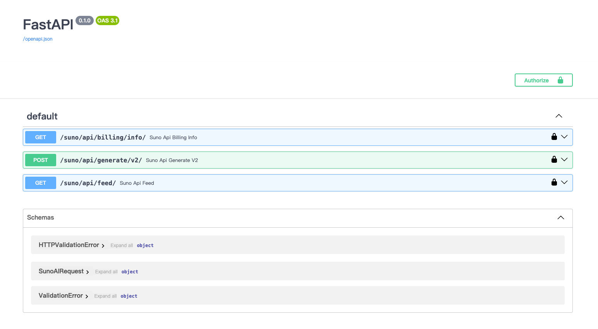

# 1. [获取 SUNO_API_KEY](https://suno.com/)



# 2. 拉取镜像

```shell
docker run --name suno-free-api -d -p 8000:8000 chatfire/suno-free-api
```

# 3. 接口文档



---

# todo:

- 支持异步任务
- chat接口
- goamz接口
- 官方接口
- 多api-keys轮询 【pro】
- redis统一任务 【pro】
- 结果转存oss 【pro】
- 定制化开发 【pro】